# TaskWiser Frontend

**TaskWiser Frontend** is a modern, **light & dark-themed, role-based task management web application** built with React. It delivers a **seamless, intuitive experience** for both users and administrators, allowing efficient management of tasks, users, and analytics through **interactive dashboards and real-time updates**.

🌐 **Live Demo:** [https://taskwiser.vercel.app](https://taskwiser.vercel.app)
> **Note:** Screenshots of all dashboards in light & dark modes, and mobile & desktop views, are provided at the end of the document.


## 🚀 Overview

TaskWiser’s frontend empowers individuals and teams to **organize, track, and manage tasks effortlessly**. With **role-based access control**, dynamic filtering, advanced analytics, and a **responsive, modern UI**, it ensures productivity and clarity across devices and platforms.

### ✨ Key Features

- **🔐 Secure Authentication** – JWT-based login with **refresh tokens** and OAuth2 (Google and GitHub Login)
- **👥 Role-Based Dashboards** – Dedicated interfaces for Users and Administrators
- **📊 Interactive Analytics** – Real-time charts and statistics for admins using Recharts
- **🎨 Modern UI/UX** – Light and dark themes with Tailwind CSS for a polished look
- **⚡ Real-Time Updates** – Instant toast notifications for task events
- **📱 Fully Responsive** – Optimized for desktops, tablets, and mobile devices
- **🔍 Advanced Filtering & Sorting** – Effortlessly manage and prioritize tasks
- **🖥️ Clean Code Structure** – Organized components for maintainability and scalability

## 🛠️ Technologies Used

### Core Technologies

- **React 19.1.1** - Modern React with hooks and context
- **Vite 7.1.2** - Fast build tool and development server
- **React Router DOM 7.8.2** - Client-side routing
- **Tailwind CSS 4.1.12** - Utility-first CSS framework

### State Management & API

- **Context API** - Built-in React state management
- **Axios 1.11.0** - HTTP client for API communication
- **JWT Decode 4.0.0** - JWT token handling

### UI Components & Visualization

- **Lucide React 0.542.0** - Beautiful icon library
- **React Hot Toast 2.6.0** - Toast notifications
- **Recharts 3.2.1** - Data visualization library
- **React Datepicker 8.7.0** - Date selection components
- **Date-fns 4.1.0** - Date manipulation utilities

### Development Tools

- **ESLint** - Code linting and formatting
- **Vite Plugin React** - React development support

## 📁 Project Structure

```
src/
├── components/           # Reusable UI components
│   ├── context/         # React Context providers
│   │   ├── AuthContext.jsx      # Authentication state management
│   │   ├── UsersContext.jsx     # User data management
│   │   └── StatsProvider.jsx    # Statistics data provider
│   ├── error/           # Error page components
│   │   ├── Forbidden.jsx
│   │   ├── NotFound.jsx
│   │   └── Unauthorized.jsx
│   ├── model/           # Modal components
│   │   ├── ConfirmModel.jsx
│   │   └── Loading.jsx
│   ├── navigation/      # Navigation components
│   │   ├── AdminSidebar.jsx
│   │   ├── AdminNavbar.jsx
│   │   ├── UserSidebar.jsx
│   │   └── [other navigation components]
│   ├── protected/       # Route protection
│   │   └── ProtectedRoute.jsx
│   └── toast/           # Toast notification components
│       └── PublicToast.jsx
├── pages/               # Page components
│   ├── admin/           # Admin dashboard pages
│   │   ├── AdminDashboard.jsx
│   │   ├── components/  # Admin-specific components
│   │   │   ├── AllStats.jsx
│   │   │   ├── AllTasksAdmin.jsx
│   │   │   ├── AllUsers.jsx
│   │   │   └── charts/  # Analytics charts
│   │   └── pages/       # Admin page layouts
│   ├── auth/            # Authentication pages
│   │   ├── Login.jsx
│   │   ├── Register.jsx
│   │   ├── ForgotPassword.jsx
│   │   ├── ResetPassword.jsx
│   │   ├── OauthCallBack.jsx
│   │   └── AuthContext.jsx
│   ├── user/            # User dashboard pages
│   │   ├── components/  # User-specific components
│   │   │   ├── AddTask.jsx
│   │   │   ├── AllTasks.jsx
│   │   │   ├── TaskCard.jsx
│   │   │   └── ViewTask.jsx
│   │   └── pages/       # User page layouts
│   └── home/            # Landing page
│       └── Home.jsx
├── utils/               # Utility functions
│   ├── api.js           # API configuration and interceptors
│   ├── checkTokenOrRefresh.js  # Token validation
│   └── sort.js          # Sorting utilities
├── App.jsx              # Main application component
├── App.css              # Global styles
├── index.css            # CSS imports and global styles
└── main.jsx             # Application entry point
```

## 🚀 Quick Start

### Prerequisites

- **Node.js** (v18 or higher)
- **npm** (v9 or higher)
- **Git**

### Installation

1. **Clone the repository**

   ```bash
   git clone https://github.com/murugaveltarun/frontend.git
   cd frontend
   ```

2. **Install dependencies**

   ```bash
   npm install
   ```

3. **Environment Configuration**

   Create a `.env` file in the root directory:

   ```env
   VITE_BACKEND_URL=http://localhost:8080
   ```

4. **Start development server**

   ```bash
   npm run dev
   ```

5. **Access the application**

   Open your browser and navigate to `http://localhost:5173`

### Available Scripts

- `npm run dev` - Start development server
- `npm run build` - Build for production
- `npm run preview` - Preview production build

## 🔧 Configuration

### Environment Variables

| Variable           | Description          | Required | Default                 |
| ------------------ | -------------------- | -------- | ----------------------- |
| `VITE_BACKEND_URL` | Backend API base URL | Yes      | `http://localhost:8080` |

### API Configuration

The application uses Axios for HTTP requests with automatic token injection:

```javascript
// API base configuration
const api = axios.create({
  baseURL: import.meta.env.VITE_BACKEND_URL,
  withCredentials: true,
});

// Automatic JWT token injection
api.interceptors.request.use((config) => {
  const token = localStorage.getItem("token");
  if (token) {
    config.headers.Authorization = `Bearer ${token}`;
  }
  return config;
});
```

## ⚠️ Quick Notes

- Make sure the backend server is running before starting the frontend.
- Verify that the `.env` file is present and correctly configured.
- The app requires Node.js v18+ and npm v9+.
- Backend must allow CORS requests from the frontend URL (`http://localhost:5173`) to ensure proper API communication (Mention your frontend URL in your backend .env file).

## 📊 Features Overview

### User Dashboard

- ✅ Create, edit, and delete personal tasks
- ✅ Advanced filtering and sorting
- ✅ Task progress tracking
- ✅ Profile management
- ✅ Responsive design for mobile devices

### Admin Dashboard

- ✅ User management and analytics
- ✅ Task oversight across all users
- ✅ Comprehensive statistics and charts
- ✅ User activity monitoring
- ✅ Data export capabilities

### Security Features

- ✅ JWT-based authentication
- ✅ OAuth2 integration (Google,Github)
- ✅ Role-based access control
- ✅ Protected routes
- ✅ Automatic token refresh
- ✅ Secure API communication

---

## 👤 User Dashboard Screenshots

### Desktop

<div style="display: flex; gap: 10px; flex-wrap: wrap;">
  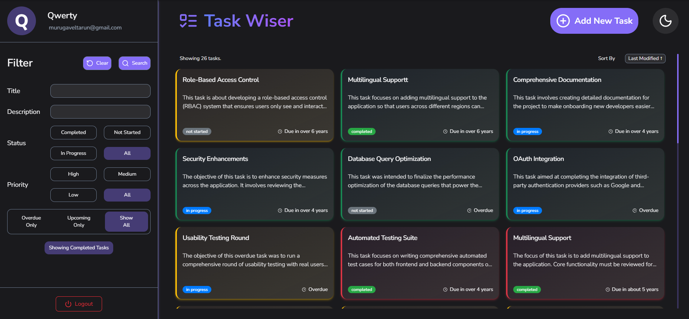
</div>

### 🌞 Light Mode

<div style="display: flex; gap: 10px; flex-wrap: wrap;">
  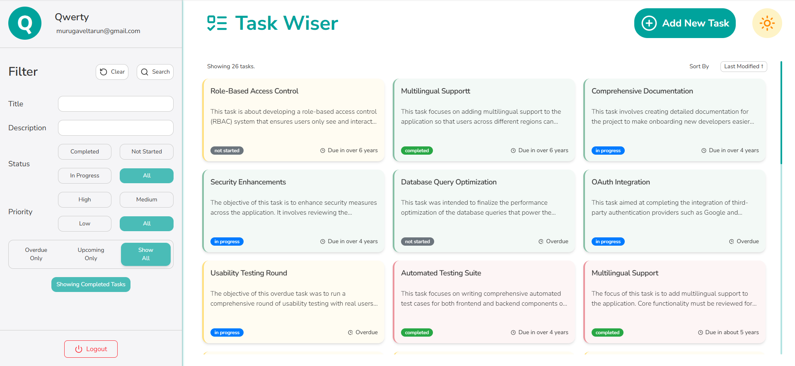
  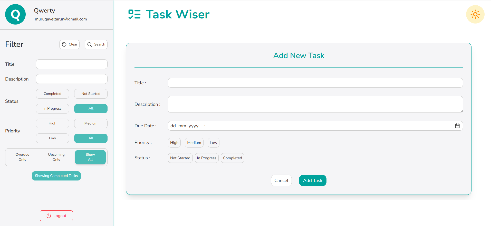
  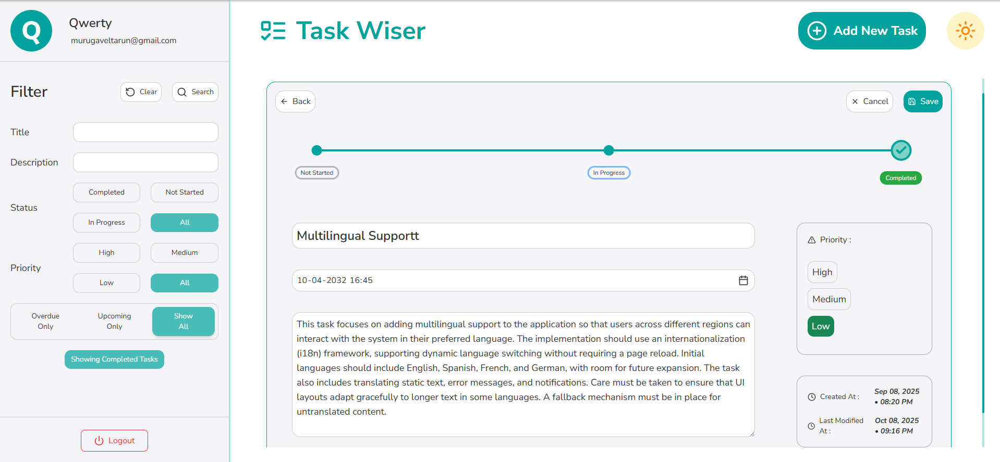
  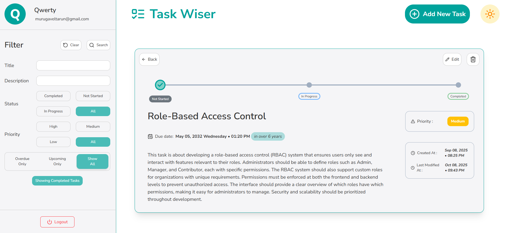
  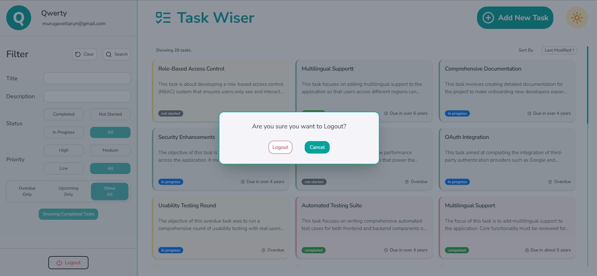
</div>


#### Mobile

<div style="display: flex; gap: 30px; flex-wrap: wrap;">
  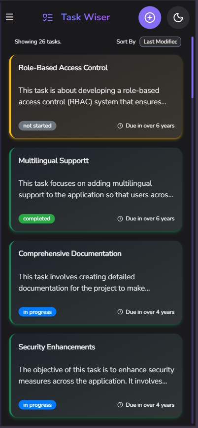
    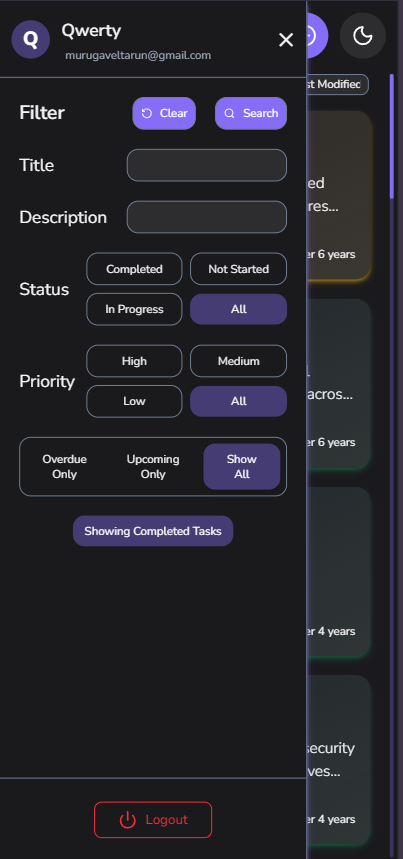
  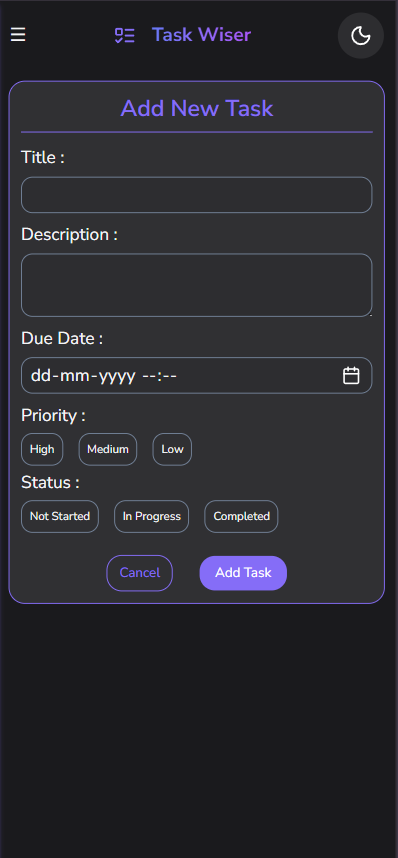
  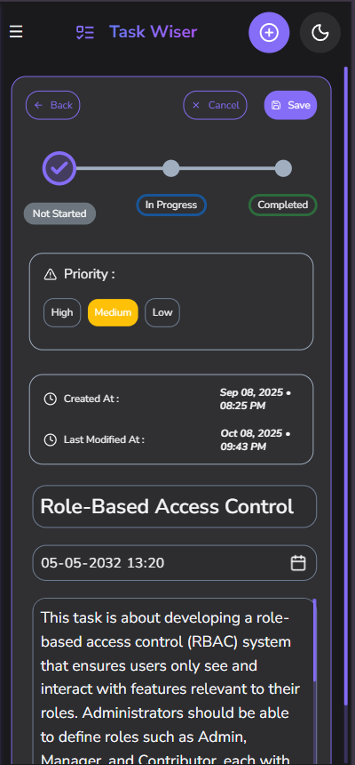
  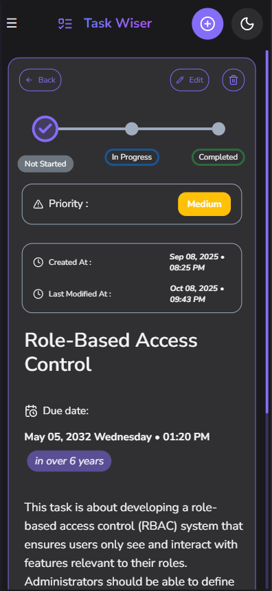
  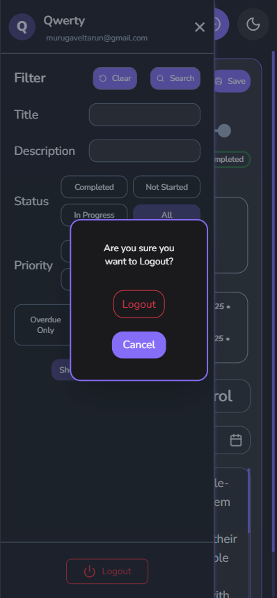
</div>

## 🏢 Admin Dashboard Screenshots

### 🌙 Dark Mode

#### Home
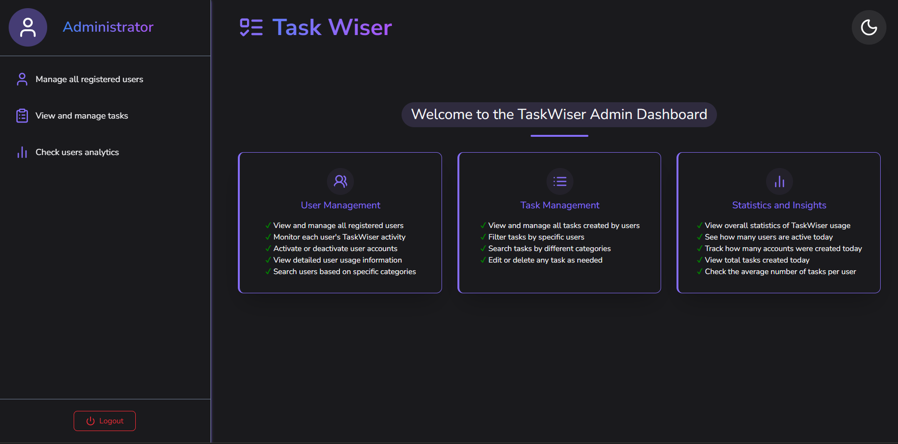

#### Statistics
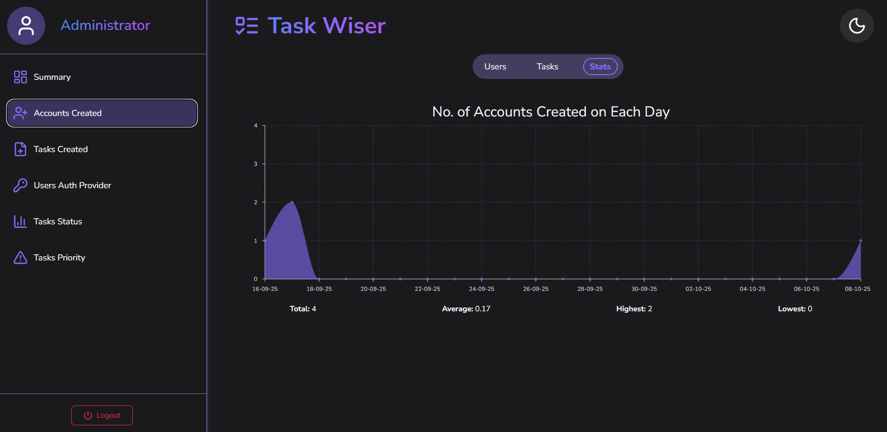
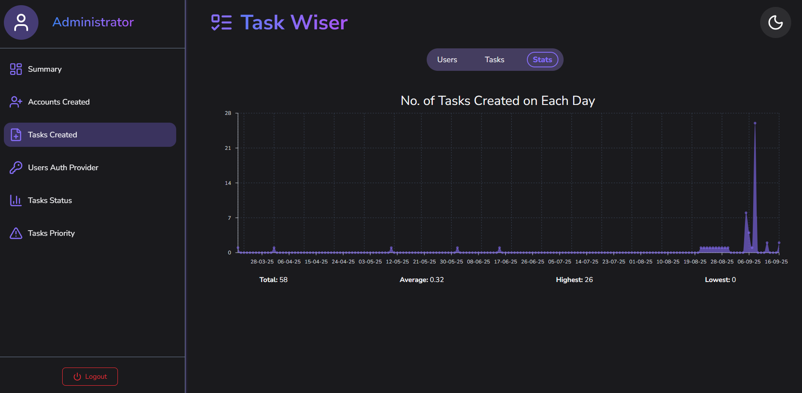
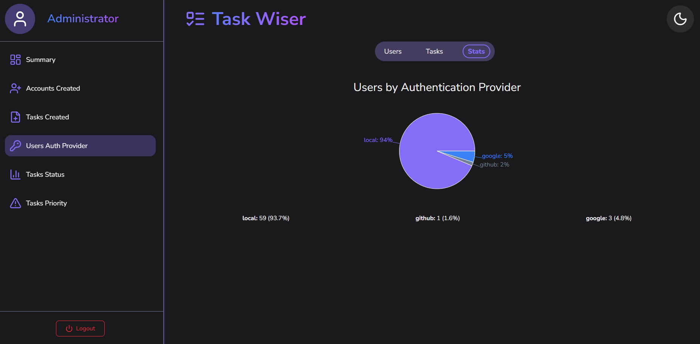
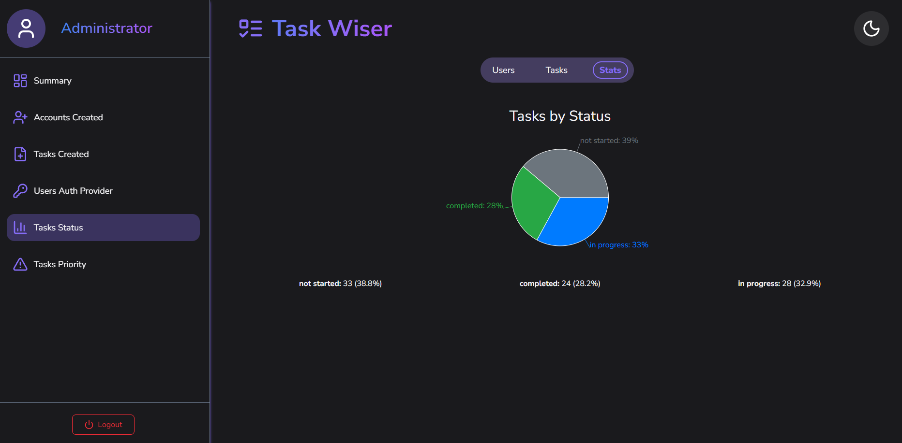
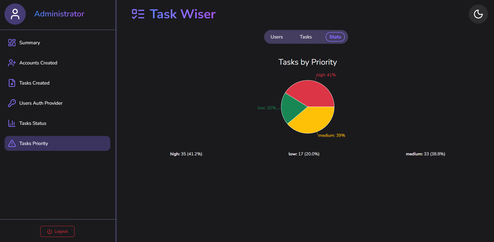
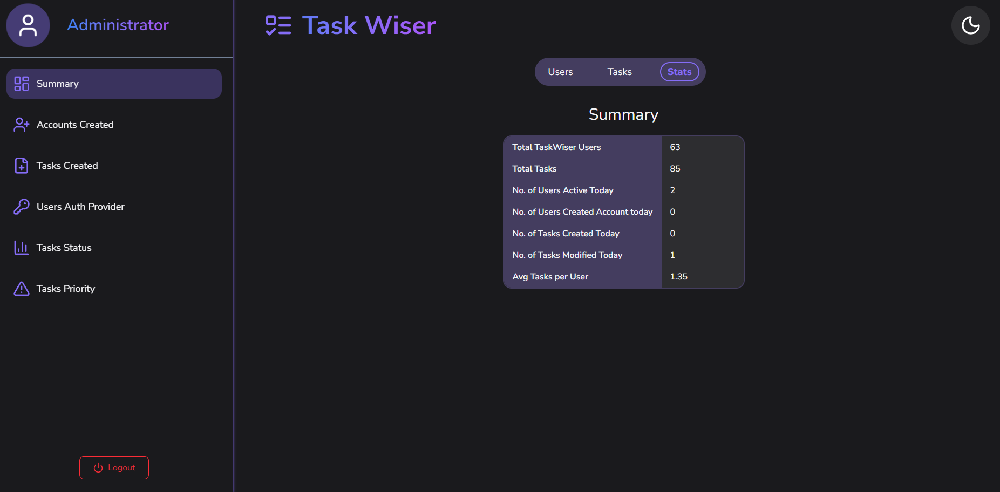

#### Tasks & Users
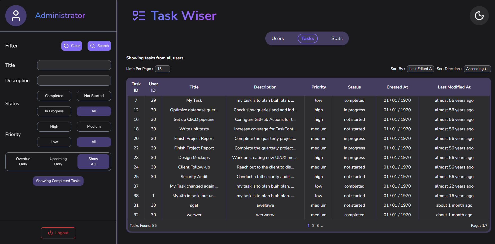
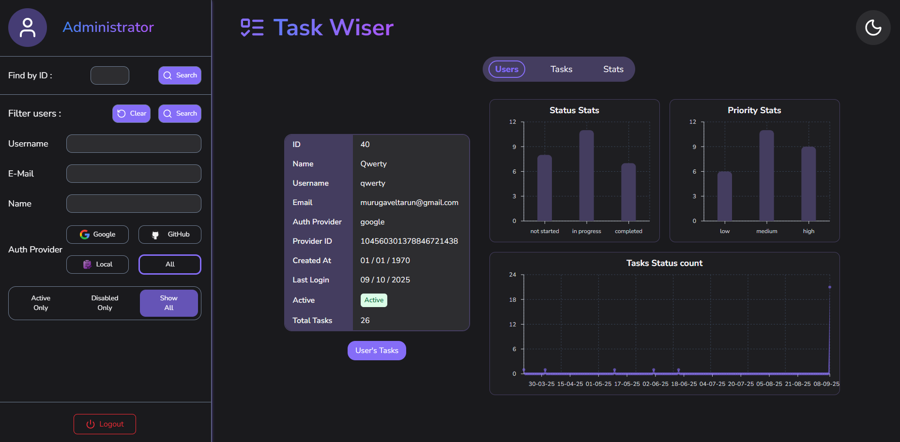
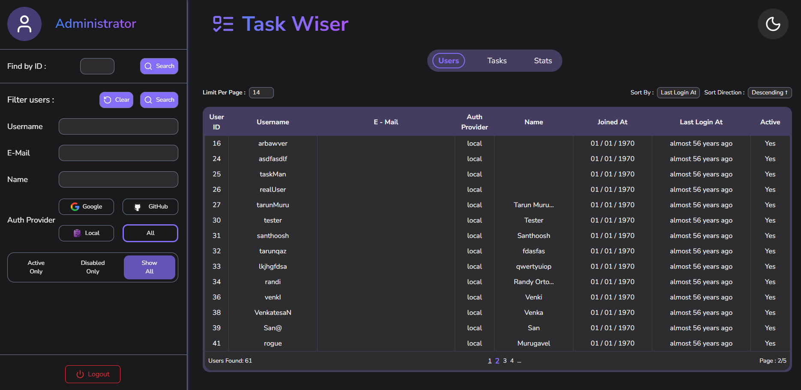

### 🌞 Light Mode

#### Home
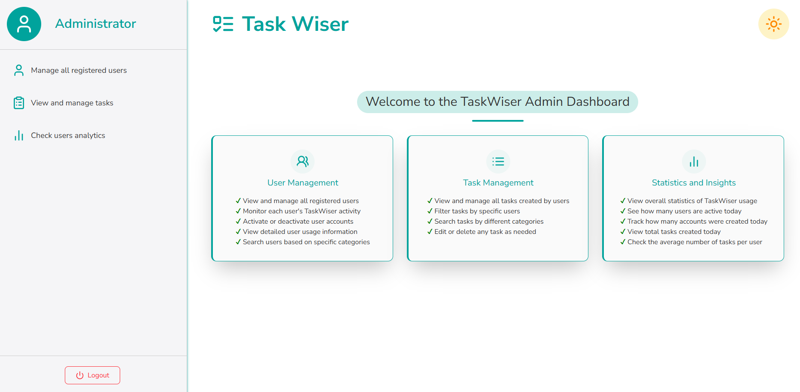

---

**Built by Tarun, Java Full Stack Developer**
